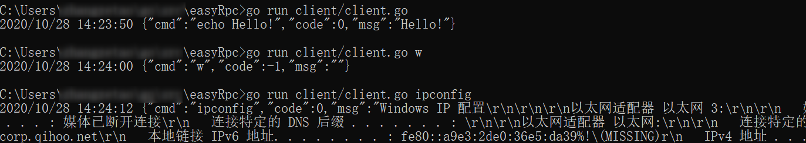

### 基于grpc 实现的精简轻量命令执行系统
`go/grpc`

##### 兼容Windows/Linux

```cassandraql
#vi etc/server.ini #配置rpc监听端口
#启动server端
#go run server/server.go
```

```cassandraql
#查看Linux 负载
#go run client/client.go "w"
#查看Windows IP地址
#go run client/client.go "ipconfig"
```
